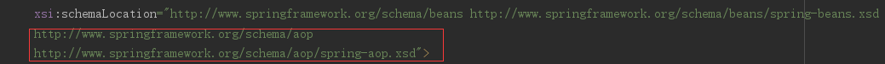

- 从spring容器获得目标类，如果配置aop，spring将自动生成代理
- 要确定目标类，aspectj 切入点表达式，导入jar包

### Demo
- 目标类
>
```java
public interface UserService {

    public void addUser();
    public void updateUser();
    public void deleteUser();

}
public class UserServiceImpl implements UserService {
    @Override
    public void addUser() {
        System.out.println("addUser");
    }

    @Override
    public void updateUser() {
        System.out.println("updateUser");
    }

    @Override
    public void deleteUser() {
        System.out.println("deleteUser");
    }
}
```

- 切面类
>
```java
public class Aspect implements MethodInterceptor {
    @Override
    public Object invoke(MethodInvocation mi) throws Throwable {
        System.out.println("前");
        Object obj=mi.proceed();  //方法执行
        System.out.println("后");
        return obj;
    }
}
```
- Bean配置
>
- 命名空间配置



```java
    <!--1 创建目标类-->
    <bean class="Lee.spring_aop.UserServiceImpl" id="userServiceId1"></bean>
    <!--2 创建切面类-->
    <bean id="aspectServiceId1"  class="Lee.Factory_bean.Aspect"></bean>
    <!--3 aop编程
          3.1 导入命名空间
      
          3.2 使用<aop:config>进行配置

                op:pointcut  切入点  从目标对象获得方法方法

                aop:advisor   通知   特殊的切面，只有一个通知和一个切入点
                    advice-ref  通知应用
                    pointcut-ref 切入点引用
          3.3 切入点表达式
          execution(* Lee.spring_aop.*.*(..))
          选择方法  返回值任意   包    类名任意  方法名任意  参数任意
    -->
    <aop:config>
        <aop:pointcut id="pointCut" expression="execution(* Lee.spring_aop.UserServiceImpl.*(..))" />
        <aop:advisor advice-ref="aspectServiceId1" pointcut-ref="pointCut" />
    </aop:config>
```
- Test
>
```java
public class Test {
    public static void demo1(){
        String xmlPath="Lee/spring_aop/beans.xml";
        ApplicationContext applicationContext=new ClassPathXmlApplicationContext(xmlPath);
        //获得目标类
        UserService userService=(UserService)applicationContext.getBean("userServiceId1");
        userService.addUser();
        userService.updateUser();
        userService.deleteUser();
    }
    public static void main(String[] args) {
        demo1();
    }
}
```
