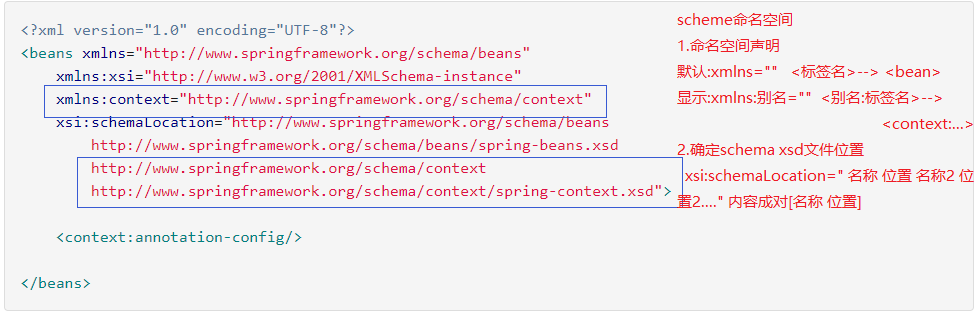

## 装配Bean基于注解
- 就是一个类，使用@注解名称 
- 开发中: 使用注解 取代xml配置文件。
>
```
   1. @Component 取代 <bean class="">
       @Conponent("id") 取代<bean id="" class="">
   2.web开发,提供3个@Conponent注解衍生注解(功能一样)  
        @Repository ：dao层
        @Service ：service层
        @Controller ：web层
   3.依赖注入  给私有字段设置，也可以给setter方法设置
        普通值：@Value("")
        引用值:
              方式1：按照[类型]注入
                   @Autowired
              方式2：按照[名称]注入1
                   @Autowired
                   @Qualifier("名称")
              方式3：按照[名称]注入2
                    @Resource("名称")
   4.生命周期
       初始化：@PostConstruct
       销毁：@PreDestroy
   5.作用域
       @Scope("prototype")多例  
```

- 注解使用前提，添加命名空间，让spring扫描含有注解的类 


- 实例配置信息
>
```java
<beans xmlns="http://www.springframework.org/schema/beans"
       xmlns:xsi="http://www.w3.org/2001/XMLSchema-instance"
       xmlns:context="http://www.springframework.org/schema/context"
       xsi:schemaLocation="http://www.springframework.org/schema/beans
        http://www.springframework.org/schema/beans/spring-beans.xsd
        http://www.springframework.org/schema/context
        http://www.springframework.org/schema/context/spring-context.xsd">
        <!--组件扫描  带注解的类-->
        <context:component-scan base-package="Lee.Bean.Annotation.a_Ioc"></context:component-scan>
    <context:annotation-config/>
</beans>
```

### 代码实例1
>
```java
 //1.Dao:
 public interface StudentDao {
    public void save();
   }
 ---------------- 
 import org.springframework.stereotype.Repository;  

 @Repository("studnetDaoId")
 public class StudentDaoImpl implements StudentDao {
     @Override
     public void save() {
        System.out.println("dao");
      }
    }
 //2.Service
 public interface StudentService {
    public void addStudent();
 }
----------------
import org.springframework.beans.factory.annotation.Autowired;
import org.springframework.beans.factory.annotation.Qualifier;
import org.springframework.stereotype.Service;

@Service
public class StudentServiceImpl implements StudentService{

    private StudentDao studentDao;
    @Autowired
    @Qualifier("studnetDaoId")
    public void setStudentDao(StudentDao studentDao) {
        this.studentDao = studentDao;
    }

    @Override
    public void addStudent() {
       studentDao.save();
    }

}
//3.Action
import org.springframework.beans.factory.annotation.Autowired;
import org.springframework.stereotype.Controller;

@Controller("studentActionId")
public class StudentAction {
    @Autowired
    private StudentService studentService;

    public void execute() {
        studentService.addStudent();
    }
}
//Test
import org.springframework.context.ApplicationContext;
import org.springframework.context.support.ClassPathXmlApplicationContext;

public class TestWeb {
    public static void demo2(){
        //从Spring容器中获得
        //1.获得容器
        String xmlPath="Lee/Bean/Annotation/b_web/bean.xml";
        ApplicationContext applicationContext=new ClassPathXmlApplicationContext(xmlPath);
        //2.获得内容，从Spring中获取
        StudentAction studentAction =(StudentAction)applicationContext.getBean("studentActionId");

        studentAction.execute();
    }

    public static void main(String[] args) {
        demo2();
    }
}

```

### 实例2
>
```java
public interface UserService {
    public void addUser();
}
----------
import org.springframework.context.annotation.Scope;
import org.springframework.stereotype.Service;

import javax.annotation.PostConstruct;
import javax.annotation.PreDestroy;

@Service("userServiceId")
//@Scope("prototype")
public class UserServiceImpl implements UserService {
    @Override
    public void addUser() {
        System.out.println("c_ohter add user");
    }
    @PostConstruct
    public void myInit(){
        System.out.println("初始化");

    }
    @PreDestroy
    public void myDestroy(){
        System.out.println("销毁");
    }
}
//Test
public class Testother {

    //spring
    public static void demo2(){
        String xmlPath="Lee/Bean/Annotation/c_ohter/bean.xml";
        ClassPathXmlApplicationContext applicationContext=new ClassPathXmlApplicationContext(xmlPath);
        UserService userService=applicationContext.getBean("userServiceId", UserService.class);
        UserService userService1=applicationContext.getBean("userServiceId", UserService.class);
        System.out.println(userService);
        System.out.println(userService1);
        applicationContext.close();
    }

     public static void main(String[] args) {
        demo2();
    }
}

```
 
