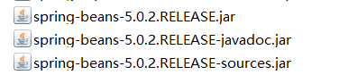

## 编写流程
1. 导入jar包(4+1)
- 4个核心(beans,core,context,expression)+1个依赖(commons-logging....jar) 
- **RELEASE** 字节码，所需要的jar包  
**RELEASE-javadoc** 文档  
**RELEASE-sources** 源码  
  

2. 目标类
 - 提供UserService接口和实现类
 - 提供UserService实现类的实例
>之前开发中，直接new一个对象即可，在Spring中，将有Spring创建对象实例->IoC控制反转，需要实例对象时，从Spring工厂中获得，需要将实现类的权限定名称配置到xml文件中
3. 配置文件
- 位置:任意，开发中一般在classpath下(src)
- 名称:任意，开发中常用applicationContext.xml
- 内容：添加schame
```java

xmlns="http://www.springframework.org/schema/beans"
       xmlns:xsi="http://www.w3.org/2001/XMLSchema-instance"
       xsi:schemaLocation="http://www.springframework.org/schema/beans http://www.springframework.org/schema/beans/spring-beans.xsd">
    <!--配置Service
    <bean> 配置需要创建的对象
            id:用于之后从spring容器获得实例时使用
            class：需要创建的实例的权限定类名
    -->
 <bean id="userServiceId" class="Lee.UserServiceImpl"></bean>
```

## 代码
```java
package Lee;

import org.springframework.context.ApplicationContext;
import org.springframework.context.support.ClassPathXmlApplicationContext;

public class TestIoC {

    public static void demo1(){
        //之前开发
        UserService us=new UserServiceImpl();
        us.addUser();
    }
    public static void demo2(){
        //从Spring容器中获得
        //1.获得容器
        String xmlPath="Lee/bean.xml";
        ApplicationContext applicationContext=new ClassPathXmlApplicationContext(xmlPath);
        //2.获得内容，从Spring中获取
        UserService us=(UserService)applicationContext.getBean("userServiceId");
        us.addUser();
    }

    public static void main(String[] args) {
        demo1();
        demo2();
    }
}


```
